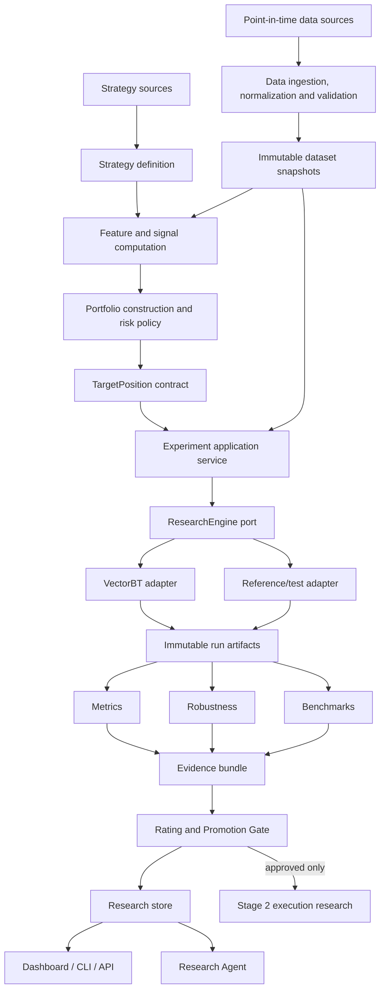
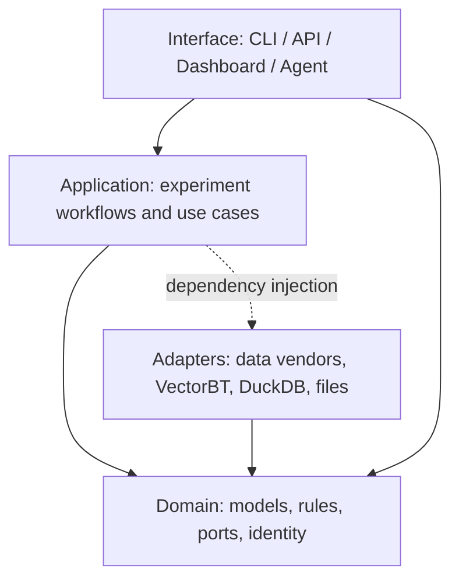

# QuantVerify 项目总体架构

> 版本：v0.2
> 状态：Stage 1 基线架构
> 最后更新：2026-08-10
> 配套文档：[架构审查](ARCHITECTURE_REVIEW.md) · [实施计划](IMPLEMENTATION_PLAN.md)

## 1. 执行摘要

QuantVerify 是一个 **Strategy Research Laboratory（策略研究实验室）**，不是回测脚本集合，也不是交易终端。它把策略想法转换为有版本、可重复、可比较、可审计的实验，并用样本外和稳健性证据决定策略能否进入更昂贵的执行研究。

项目分为两个有明确契约边界的阶段：

1. **Stage 1 — Signal Research**：研究在每个决策时点应持有什么目标组合；
2. **Stage 2 — Execution Research**：研究目标组合在真实市场约束下如何变成订单、成交和实际持仓。

Stage 1 的正式交付物不是订单，而是带有 `decision_at` 和 `effective_at` 的 `TargetPosition`。Stage 2 只消费通过 Promotion Gate 的策略及目标仓位，不反向污染 Stage 1 的领域模型。

本架构的优先级依次为：

1. 因果正确性与无前视偏差；
2. 可复现性与完整实验谱系；
3. 样本外证据和过拟合控制；
4. 批量研究效率；
5. 可替换的基础设施；
6. UI、Agent 和交易执行能力。

## 2. 产品边界与成功标准

### 2.1 Stage 1 回答的问题

- 策略是否在扣除合理成本后仍有稳定超额收益？
- 结果是否跨参数、时间、标的和市场状态成立？
- 结论是否来自真正隔离的样本外数据？
- 数据、代码、配置和环境能否重建同一结果？
- 与 Buy & Hold、指数、现金或其他策略相比是否改善风险收益？
- 证据强度是否足以进入执行研究？

### 2.2 Stage 1 不负责的问题

- 订单簿队列、部分成交、撤单和智能路由；
- 复杂市场冲击和经纪商网关；
- 高频或 tick 级微观结构；
- 实盘风控、资金调拨和账户运营。

Stage 1 仍必须显式建模手续费、税费、基础滑点、换手约束、可交易性和最小执行延迟，否则研究结论无效。

### 2.3 MVP 的可验收定义

MVP 不是“完成一个网站”，而是满足以下能力：

- 至少 20 个结构不同的策略；
- 多标的、多参数和多个历史区间的批量实验；
- 所有运行具有可重建的数据、代码、配置和环境指纹；
- 默认执行无前视偏差检查；
- 至少支持时间切分、参数稳定性、跨标的和成本敏感性；
- 产生标准化指标、稳健性报告、评级和 Promotion 决策；
- 任意 Dashboard 数值均可追溯到一个不可变运行。

## 3. 核心概念模型

```text
StrategyIdea
    -> StrategySpec + StrategyVersion
    -> Signal / Forecast
    -> PortfolioConstruction + RiskPolicy
    -> TargetPosition(decision_at, effective_at)
    -> ResearchEngine
    -> BacktestArtifacts
    -> Metrics + Robustness + BenchmarkEvidence
    -> StrategyRating
    -> PromotionDecision
```

初稿中的 `Signal → TargetPosition` 过于直接。信号表达预测或偏好，目标仓位还必须经过组合构建、约束和风险预算。同一个信号可对应不同仓位；这三者不得混为一体：

| 对象 | 含义 | 示例 |
|---|---|---|
| Signal / Forecast | 对未来收益或方向的观点 | SPY score = 0.8 |
| TargetPosition | 在约束后期望达到的组合权重 | SPY weight = 25% |
| ActualPosition | 执行后真实持仓 | SPY weight = 23.7% |

## 4. 总体架构



核心原则是：**QuantVerify 拥有领域语义、实验编排、验证协议、证据和知识；第三方引擎只实现端口。**

## 5. 分层和依赖规则

采用模块化单体与 Hexagonal Architecture。Stage 1 不使用微服务。



依赖规则：

- `core/domain` 不依赖 pandas、VectorBT、DuckDB、Streamlit 或供应商 SDK；
- `application` 只依赖领域对象和端口；
- adapter 依赖并实现核心端口；
- interface 只调用 application use case，不直接查询底层存储；
- 策略不得依赖 Dashboard、SQL、VectorBT 内部对象或 vn.py；
- 跨模块只通过公开契约，不导入另一个模块的私有实现。

推荐代码布局：

```text
quantverify/
├── core/                 # 稳定领域模型、identity、errors、ports
├── application/          # experiment/validation/promotion use cases
├── data/                 # 数据端口实现、PIT 校验、snapshot
├── features/             # 特征注册和因果计算
├── strategies/           # 策略实现与注册
├── portfolio/            # 组合构建、约束、风险预算
├── experiments/          # 矩阵展开、调度、lineage
├── engines/              # VectorBT 等 ResearchEngine adapters
├── metrics/              # 独立指标实现
├── robustness/           # 样本外及稳健性协议
├── benchmarks/           # 基准生成与对齐
├── rating/               # 评级与 Promotion policy
├── storage/              # Parquet/DuckDB adapters
├── interfaces/           # CLI/API
├── dashboard/            # 只读研究控制台
└── agents/               # 经审批的 research workflow
```

## 6. 数据架构与 Point-in-Time 语义

### 6.1 标准 Bar Schema

最小字段：

```text
asset_id
event_time             # 市场事件发生时间
available_time         # 研究者在当时最早可获知时间
open/high/low/close
volume
currency
venue
source
ingested_at
dataset_version
adjustment_mode
```

可选字段包括 amount、turnover、market_cap、fundamental values、suspend flag、limit up/down。基本面、指数成分、公司行动等修订型数据必须同时记录：

- `event_time`：数据对应的经济时期；
- `available_time`：当时可用于决策的时间；
- `ingested_at`：系统摄取时间。

只保存一个 `timestamp` 无法防止未来信息泄漏。

### 6.2 数据流水线

```text
Provider -> Raw immutable landing -> Normalizer -> Validator
         -> Dataset manifest -> Partitioned Parquet -> DuckDB catalog
```

每个 snapshot manifest 至少包含：

- 数据集 ID、schema 版本和内容 SHA-256；
- 来源、拉取时间和许可信息；
- 市场、频率、时区和交易日历；
- 复权方式、币种和公司行动处理方式；
- 行数、时间范围、标的范围和分区清单；
- 数据质量结果及例外白名单。

### 6.3 强制质量门

- 主键唯一、时间单调、OHLC 关系合法；
- 价格、成交量和币种字段范围合法；
- 交易日历、时区及 DST 明确；
- 缺口、停牌、退市和无交易日可区分；
- 复权价格不得与现金分红再次重复记账；
- 动态 universe 使用历史成分，不使用今天的成分回测过去；
- 任何质量失败默认阻止实验，而不是静默填充。

### 6.4 存储选择

Stage 1 使用 Parquet 保存大体量不可变 artifacts，DuckDB 保存目录和研究查询。DuckDB 不是 artifact 本身的唯一事实来源。并发写入采用单 writer 或 append-only 文件后批量合并；多用户和高并发出现后再评估 PostgreSQL。

## 7. 策略、特征与组合构建

### 7.1 StrategySpec

策略定义需要同时是人可读配置和版本化代码。纯 YAML 表达式只适合简单策略，复杂策略可引用注册的 Python 实现；禁止执行任意未审核表达式。

```yaml
schema_version: 1
strategy:
  id: ma_cross
  version: 1.0.0
  implementation: quantverify.strategies.trend.ma_cross
decision:
  frequency: 1d
  at: bar_close
features:
  short_ma: {type: sma, window: ${short_window}}
  long_ma: {type: sma, window: ${long_window}}
signal:
  rule: short_ma > long_ma
portfolio:
  allocator: single_asset_long_flat
  gross_limit: 1.0
execution_assumption:
  price: next_open
  lag_bars: 1
parameters:
  short_window: [5, 10, 20]
  long_window: [30, 60, 120]
```

### 7.2 Feature Registry

Feature 定义必须包含名称、版本、输入 schema、参数 schema、warm-up、缺失值政策和可用时间规则。缓存键由 feature version、参数和 dataset hash 构成。特征实现必须通过“截断未来数据后历史输出不变化”的因果性测试。

### 7.3 Portfolio Construction

组合构建负责：

- signal 到权重的映射；
- gross/net exposure、单资产、行业和流动性约束；
- 波动率目标、风险预算和杠杆限制；
- 多币种现金及 FX 转换；
- 再平衡频率、权重容差和不可交易资产处理。

## 8. 时间、信号和成交语义

这是系统最重要的正确性边界。

`TargetPosition` 至少包含：

```text
asset_id
decision_at            # 策略做出决定的时间
effective_at           # 最早允许成为实际仓位的时间
target_weight
base_currency
strategy_version
```

规则：

- `effective_at` 必须晚于 `decision_at`；
- 默认日线“收盘信号”不能以同一收盘价成交；
- 引擎必须明确 close-to-close、open-to-open 或 open-to-close 的收益口径；
- 特征 warm-up、信号 lag、成交 lag 不得重复或遗漏；
- 时区转换必须发生在明确的市场日历语境内；
- 缺失 bar 不等于零收益，停牌不等于清仓；
- 多资产组合必须定义同步和估值政策。

任何允许 same-bar execution 的研究配置都需要显式标记、记录理由并在 Rating 中降低 evidence quality。

## 9. Experiment 是一级对象

实验描述“要验证什么”；运行描述“在哪个环境执行了一次”。二者不能共用一个 ID。

```text
ExperimentConfig =
    StrategyVersion
  x UniverseSnapshot
  x DatasetSnapshot
  x TimeRange
  x Frequency
  x Parameters
  x PortfolioPolicy
  x CostModel
  x ExecutionAssumptions
  x Benchmark
  x ValidationProtocol
  x EngineVersion
  x RandomSeed
```

### 9.1 身份模型

- `experiment_id`：上述科学输入的 canonical JSON 经 SHA-256 生成；
- `run_id`：`experiment_id + source_commit + environment_lock_hash + worker/runtime`；
- `artifact_id`：artifact 内容哈希；
- 参数字典顺序不能改变 ID；任一科学输入改变必须产生新 experiment ID；
- 重跑相同实验不得覆盖旧结果，结果应去重或并列记录。

每次运行必须记录状态机：`pending -> running -> succeeded | failed`，以及开始/结束时间、错误分类、日志和产生的 artifacts。

### 9.2 执行与调度

初期使用进程内 runner 和显式批处理。只有当本地并行和单机资源限制成为真实瓶颈后才引入任务队列。调度器必须支持：

- 幂等重试；
- 最大参数组合和资源预算；
- 失败隔离与部分结果可见；
- deterministic seed；
- 取消和断点恢复；
- CPU、内存、耗时及 artifact 体积记录。

## 10. Research Engine 端口

VectorBT 适合多参数和多资产向量化研究，但不能泄漏到领域层。

```python
class ResearchEngine(Protocol):
    def run(
        self,
        config: ExperimentConfig,
        market_data: ArtifactRef,
        targets: Sequence[TargetPosition],
    ) -> Sequence[ArtifactRef]: ...
```

统一输出以 versioned artifact schemas 表达：

- equity curve；
- period returns；
- target/effective/actual positions；
- trades 与 turnover；
- costs breakdown；
- cash、FX 和 exposure；
- warnings 和执行假设；
- engine diagnostics。

至少维护一个小型 reference engine/fixture，用于 golden tests。VectorBT adapter 的关键结果必须与 reference fixtures 对账，避免升级引擎后静默改变语义。

## 11. Metrics 和 Benchmark

Metrics 独立于回测引擎。所有指标定义需版本化并明确：

- 收益频率、年化因子和交易日历；
- 算术或几何收益；
- 风险免费利率的来源及对齐；
- 缺失值和短样本政策；
- gross/net of costs；
- 样本内、验证集和测试集标签。

指标组：Return、Risk、Risk-adjusted、Trading、Exposure、Relative。Benchmark 本身应使用相同的数据、成本、日历和评估区间生成可追溯运行，禁止拿口径不一致的外部曲线直接比较。

## 12. Robustness 与研究协议

目标不是寻找最高收益参数，而是评估 Edge 是否稳定。

### 12.1 首批强制验证

- Temporal train/validation/test split；
- Purged/embargoed walk-forward（标签重叠时）；
- Parameter neighborhood stability；
- Cross-asset / cross-market stability；
- Market regime stability；
- Cost and delay sensitivity；
- Benchmark-relative out-of-sample performance。

### 12.2 后续统计控制

- Trade/return block bootstrap；
- Deflated Sharpe Ratio；
- Probability of Backtest Overfitting / CSCV；
- Multiple-testing correction；
- Strategy correlation 和家族级选择偏差控制。

必须记录全部尝试过的实验，而不只记录“获胜者”。测试集原则上只解封一次；解封后继续调参意味着原测试集转为训练历史，必须创建新的最终检验期。

## 13. Rating 与 Promotion Gate

Rating 是 policy，不是散落在 UI 中的公式。输入包括：

```text
Performance + Risk + OOS Evidence + Robustness + Generalization
+ Cost Resistance + Complexity + Data Quality + Research Conduct
```

输出包括分维度得分、总等级、置信度、否决原因和 policy version。任何硬性 gate 失败都不能被高收益抵消，例如：

- 数据质量或可复现性失败；
- 明确的 look-ahead / survivorship bias；
- 测试集低于最低样本长度；
- 成本压力下完全失效；
- 样本外表现未达标；
- 研究尝试记录不完整。

权重和阈值必须在独立研究协议中版本化，不在代码里写匿名常量。Promotion 决策由 reviewer 和时间戳审计，不由 Agent 自动批准。

## 14. Result Store 与查询模型

主要实体：

```text
strategies / strategy_versions
universe_snapshots / dataset_snapshots
experiments / runs / run_attempts
artifact_manifests
metric_sets / robustness_reports
ratings / promotion_decisions
research_notes / audit_events
```

存储规则：

- artifacts 不可变，元数据 append-only；
- schema 版本和 migration 明确；
- 大数组保存在 Parquet，不塞入单个数据库字段；
- Dashboard 通过 read model 查询，不直接推导研究结论；
- 删除或归档遵循数据许可、磁盘预算和研究审计政策。

## 15. Dashboard、API 与 Agent

### 15.1 Dashboard

首期使用 Streamlit + Plotly，页面包括策略概览、运行详情、净值/回撤、参数表面、跨资产、稳健性、数据质量、Leaderboard 和 Promotion review。每个图表必须展示 experiment/run ID、数据 snapshot、成本口径及 IS/OOS 标签。

### 15.2 API/CLI

自动化首先通过稳定 CLI 和 application service 完成，Dashboard 不承担编排逻辑。长期产品化时再增加 FastAPI；React 只在交互复杂度和多用户需求已验证后引入。

### 15.3 Research Agent

Agent 可以发现、解释、形式化、生成草案实验并撰写报告，但不能：

- 静默改变策略定义；
- 选择性隐藏失败实验；
- 解封测试集或自动批准 Promotion；
- 执行未审核代码或访问未授权 secrets；
- 绕过成本、数据质量和资源预算。

所有 Agent 动作写入审计日志，生成的 StrategySpec 先经 schema validation 和人工审批。

## 16. Stage 2 接口预留

Stage 2 消费：

```text
Approved StrategyVersion
+ TargetPosition stream
+ ExecutionPolicy
+ Market/Account constraints
```

并产出 Order、Fill、ActualPosition 和 implementation shortfall。VeighNa、RQAlpha 和 LEAN 作为 ExecutionEngine adapters，不成为顶层领域模型。Stage 1 暂不实现这些 adapter，只冻结 `TargetPosition` 的语义和版本策略。

## 17. 非功能需求

### 17.1 正确性

- golden dataset + golden results；
- unit、contract、property、integration 和 regression tests；
- adapter 交叉对账；
- dependency upgrade 后进行结果差异审查。

### 17.2 可复现性

- 锁定依赖环境；
- 记录 source commit、Python/engine version 和 seed；
- dataset 与 artifact content addressing；
- 时间和随机数由注入的 clock/RNG 管理。

### 17.3 性能

MVP 目标在 Milestone 1 基线后实测确定。不得在没有 benchmark 的情况下承诺吞吐。需记录单次实验 CPU、峰值内存、运行时间和缓存命中率，并设置参数爆炸预算。

### 17.4 可观测性

结构化日志包含 experiment_id、run_id、strategy_id 和 dataset_id；错误按 data/config/engine/resource/internal 分类。运行统计进入 research metadata，不依赖人工翻日志。

### 17.5 安全与治理

- secrets 只存环境变量或 secret manager；
- raw data、凭证和生成 artifacts 默认不进 Git；
- 数据源许可、再分发限制和保留策略进入 manifest；
- Strategy DSL 不使用任意 `eval`；
- dependency 和供应链扫描纳入 CI。

## 18. 技术栈和演进约束

Stage 1 基线：Python 3.11/3.12、Pydantic v2、NumPy、pandas、PyArrow/Parquet、DuckDB、VectorBT adapter、PyYAML、pytest、Ruff、mypy、Plotly、Streamlit。

暂不引入 Kafka、Redis、Celery、Kubernetes、微服务或独立前端。只有出现可量化的并发、可靠性或团队边界需求时，通过 ADR 引入。

## 19. 测试策略

测试金字塔：

1. **Domain unit tests**：模型、身份、时间和约束；
2. **Property tests**：无未来数据、现金守恒、ID 稳定性；
3. **Contract tests**：所有 DataProvider/ResearchEngine/Store adapter；
4. **Golden tests**：小数据集上的逐期仓位、收益、成本和指标；
5. **Integration tests**：Parquet -> experiment -> artifacts -> DuckDB；
6. **Regression tests**：依赖升级前后研究结果容差；
7. **Performance tests**：代表性实验矩阵的时间与内存。

关键不变量：

- 截断未来数据不改变过去的 feature/signal；
- 成本非负时净收益不得高于相同路径的毛收益；
- 空仓且无费用时收益为零；
- 相同输入产生相同 experiment ID；
- `effective_at > decision_at`；
- 所有展示结果都有完整 lineage。

## 20. 交付路线

采用 vertical slice，详细工作包和验收标准见 `IMPLEMENTATION_PLAN.md`：

1. **M0 Foundation**：领域契约、身份、配置、CI、测试；
2. **M1 Minimum Research Loop**：fixture/CSV -> SMA -> reference/VectorBT -> metrics -> artifacts；
3. **M2 Data and Strategy Abstractions**：snapshot、PIT、feature/strategy registry、portfolio；
4. **M3 Experiment Matrix and Store**：grid、lineage、DuckDB、CLI；
5. **M4 Robustness and Promotion**：OOS、walk-forward、稳定性、policy；
6. **M5 Research Console**：Dashboard 和可追溯 read models；
7. **M6 Research Agent**：受控 spec/report workflow；
8. **M7 Execution Research**：仅对获批策略启动。

## 21. 架构治理

- 关键决策以 ADR 记录；
- 领域 schema 使用显式版本并保持向后读取能力；
- 修改时间/收益/成本语义必须有 golden regression；
- 每个 milestone 通过 exit criteria 后再扩大范围；
- 架构文档描述当前认可的目标架构，实施计划描述落地顺序，二者不得混为状态报告。

## 22. 最终形态

```text
Strategy sources
    -> governed StrategySpec
    -> causal Signal Research
    -> immutable Research Evidence
    -> human-reviewed Promotion Gate
    -> Execution Research
    -> Paper / Live Trading
```

QuantVerify 的长期资产不是某次高收益曲线，而是可信的数据谱系、严谨的研究协议、稳定的领域契约和所有成功/失败实验形成的知识库。
