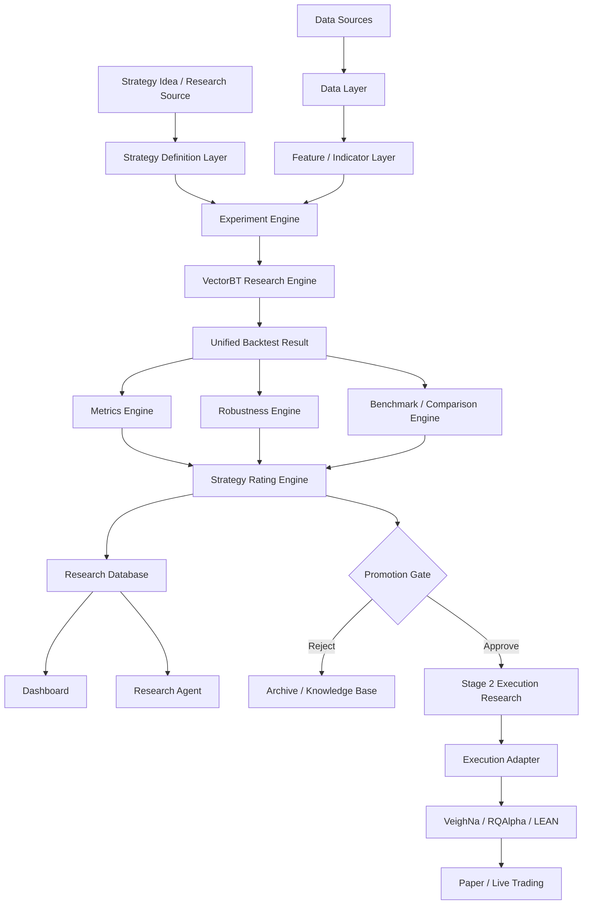
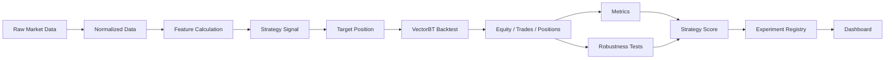
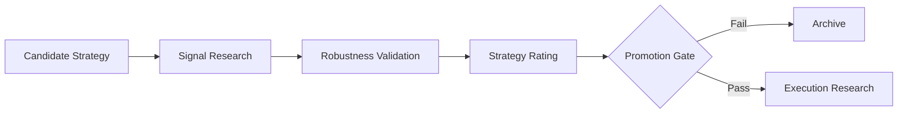
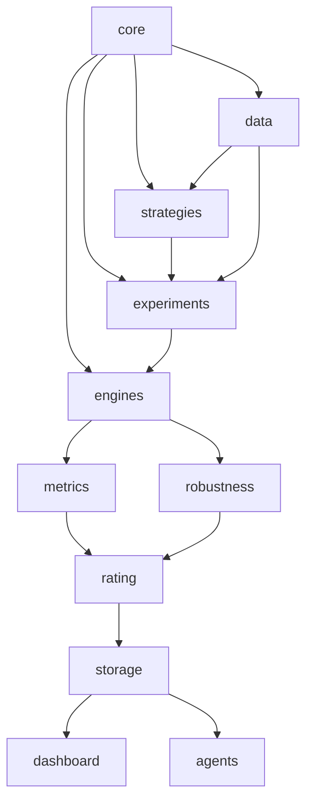

# QuantVerify 项目总体架构设计

> 版本：v0.1  
> 当前重点：Stage 1 — Signal Research  
> 后续阶段：Stage 2 — Order Execution Research / Paper Trading / Live Trading

---

## 1. 项目定位

QuantVerify 不是一个单纯的“回测脚本集合”，也不应在第一阶段被设计成一个完整交易终端。

项目的核心目标是构建一个 **Strategy Research Laboratory（策略研究实验室）**：能够把自然语言中的投资策略系统化地转换为可重复、可比较、可验证的研究实验，并从大量候选策略中筛选出少量真正值得进入高精度交易仿真和后续实盘验证的策略。

整个项目明确划分为两个研究阶段：

1. **Signal Research**：研究“什么时候应该持有什么仓位”。
2. **Order Execution Research**：研究“已经知道目标仓位后，如何真实地下单、成交和管理订单”。

Stage 1 优先完成 Signal Research；Stage 2 不在初期实现，但 Stage 1 的接口必须为 Stage 2 预留扩展空间。

---

# 2. 两阶段研究边界

## 2.1 Stage 1 — Signal Research

Stage 1 主要回答：

- 某个策略是否存在稳定的历史超额收益？
- 策略适用于哪些标的？
- 对哪些参数敏感？
- 在牛市、熊市、震荡市是否稳定？
- 策略是否只在某段历史数据中过拟合？
- 策略在不同市场、不同时间周期下能否迁移？
- 策略相对于 Buy & Hold 或其他 Benchmark 是否真正改善风险收益比？
- 300 个候选策略中，哪些值得进入下一阶段？

Stage 1 重点研究：

```text
Market Data
    ↓
Indicators / Features
    ↓
Signal
    ↓
Target Position
    ↓
Portfolio Return
    ↓
Metrics
    ↓
Robustness Validation
    ↓
Strategy Rating
```

此阶段默认不重点建模：

- 挂单队列
- Limit Order Book
- 部分成交
- 撤单
- 盘口冲击
- 订单路由
- Broker API
- 高频成交模型

但仍然需要支持基础交易成本模型，例如手续费、简单滑点、换手率惩罚，以避免完全不现实的回测结果。

---

## 2.2 Stage 2 — Order Execution Research

Stage 2 的输入不是“一个模糊策略”，而应该是 Stage 1 已经筛选出的少量候选策略。

例如：

```text
300 Strategies
      ↓
Signal Research
      ↓
30 Promising Strategies
      ↓
Robustness Validation
      ↓
10 Approved Strategies
      ↓
Order Execution Research
```

Stage 2 主要回答：

- 理论目标仓位能否真实实现？
- T+1、涨跌停、停牌等规则会造成多大偏差？
- 滑点和手续费对策略收益侵蚀多少？
- 限价单和市价单的差异是什么？
- 部分成交如何影响仓位？
- 大额订单会产生多少市场冲击？
- 理论回测收益与可执行收益差多少？

Stage 2 可以逐步接入：

- VeighNa / vn.py
- RQAlpha
- LEAN
- Paper Trading
- Broker Gateway

因此 VeighNa 更适合作为未来的 **Execution / High-Fidelity Simulation Adapter**，而不是 QuantVerify 的顶层架构。

---

# 3. 总体系统架构



核心原则：

> **QuantVerify 自己拥有 Strategy、Experiment、Validation、Rating 和 Research Knowledge；第三方框架只提供可替换的底层能力。**

---

# 4. Stage 1 核心数据流



一个策略研究实验的核心对象可以抽象为：

```text
Experiment =
    Strategy
  × Universe
  × Time Range
  × Frequency
  × Parameter Set
  × Cost Model
  × Benchmark
  × Validation Config
```

这意味着 QuantVerify 不应该以“运行一个 Python 策略脚本”为中心，而应该以 **Experiment（实验）** 为一级对象。

---

# 5. 模块总览

| 模块 | 目的 | 核心输入 | 核心输出 | Stage |
|---|---|---|---|---|
| Data Layer | 提供一致、可追溯的数据 | Raw Data | Normalized Market Data | 1 |
| Universe Layer | 定义研究标的集合 | Symbols / Rules | Universe | 1 |
| Feature Layer | 统一计算技术指标和特征 | Market Data | Feature Matrix | 1 |
| Strategy Layer | 描述策略逻辑 | Strategy Spec | Signal / Target Position | 1 |
| Experiment Engine | 编排研究实验 | Strategy + Data + Config | Experiment Run | 1 |
| Research Engine | 快速执行回测 | Signals | Backtest Result | 1 |
| Metrics Engine | 计算风险收益指标 | Backtest Result | Metrics | 1 |
| Robustness Engine | 判断是否过拟合 | Experiment Results | Robustness Report | 1 |
| Benchmark Engine | 与基准比较 | Strategy + Benchmark | Relative Performance | 1 |
| Rating Engine | 统一策略评级 | Metrics + Robustness | Strategy Score | 1 |
| Result Store | 保存完整实验谱系 | Runs / Metrics | Research DB | 1 |
| Dashboard | 可视化实验结果 | Research DB | UI / Charts | 1 |
| Research Agent | 自动研究和总结 | Strategy / Results | Research Report | 1 |
| Execution Adapter | 接入真实撮合引擎 | Target Position | Orders / Trades | 2 |

---

# 6. Data Layer

## 6.1 目的

Data Layer 的任务不是简单“下载 K 线”，而是建立整个回测系统可信度的基础。

它需要保证：

- 不同数据源转换成统一格式；
- 时间、交易日和频率一致；
- 复权方式明确；
- 数据版本可追踪；
- Strategy 不直接依赖某一个数据供应商；
- 回测结果能够追溯到具体数据版本。

## 6.2 输入

可能包括：

- Yahoo Finance
- Tushare
- AkShare
- BaoStock
- Polygon
- Broker Data
- 本地 CSV / Parquet

## 6.3 标准输出

建议统一为 OHLCV Schema：

```text
symbol
timestamp
open
high
low
close
volume
amount
adjust_factor
source
```

扩展字段：

```text
turnover
market_cap
pe
pb
dividend
suspend_flag
limit_up
limit_down
```

## 6.4 实现

建议采用：

```text
Data Provider
      ↓
Normalizer
      ↓
Validator
      ↓
Parquet
      ↓
DuckDB
```

Parquet 负责高效文件存储，DuckDB 负责本地分析查询。

Strategy 不允许直接执行：

```python
ak.stock_zh_a_hist(...)
```

而必须通过统一接口：

```python
data = data_provider.get_bars(
    symbols=["000300.SH"],
    start="2015-01-01",
    end="2025-12-31",
    frequency="1d"
)
```

---

# 7. Universe Layer

## 7.1 目的

将“策略”和“研究标的”解耦。

同一策略应该能够被系统自动运行在：

```text
A股指数
A股个股
ETF
美股指数
美股个股
商品
黄金
BTC
```

## 7.2 输入

可以是：

```yaml
universe:
  type: static
  symbols:
    - SPY
    - QQQ
    - GLD
```

也可以是规则：

```yaml
universe:
  type: dynamic
  market: CN
  index: CSI300
```

## 7.3 输出

```python
Universe(
    universe_id="csi300",
    symbols=[...],
    effective_dates=...
)
```

## 7.4 重要原则

未来必须避免：

- Survivorship Bias
- 当前成分股回测历史
- 已退市股票缺失

因此动态指数成分未来需要按历史日期恢复。

---

# 8. Feature / Indicator Layer

## 8.1 目的

统一技术指标和策略特征，避免每个 Strategy 重复实现 MA、RSI、MACD。

## 8.2 输入

```text
Normalized Market Data
+ Feature Parameters
```

## 8.3 输出

例如：

```text
close
ma5
ma10
ma20
ma60
rsi14
macd
atr14
volatility20
return20
```

## 8.4 实现

首期可以使用：

- pandas
- numpy
- pandas-ta / TA-Lib（可选）

但 QuantVerify 应维护自己的 Feature Registry：

```python
@register_feature("sma")
def sma(close, window):
    ...
```

这样 Agent 和 Strategy Spec 可以稳定引用统一特征名称。

---

# 9. Strategy Layer

Strategy Layer 是整个项目最重要的自有资产之一。

## 9.1 目的

把策略从某个具体回测框架中解耦。

Strategy 不应该天然等于：

```python
class MyStrategy(CtaTemplate)
```

而应该表达：

```text
Data
 ↓
Features
 ↓
Entry / Exit Logic
 ↓
Signal
 ↓
Target Position
```

## 9.2 Strategy Spec

建议逐步建立统一 Strategy Schema：

```yaml
strategy:
  id: ma_cross
  name: MA Cross
  category: trend_following
  frequency: daily

features:
  ma_short:
    type: sma
    window: 5
  ma_long:
    type: sma
    window: 20

entry:
  condition: ma_short > ma_long

exit:
  condition: ma_short < ma_long

position:
  long: 1.0
  flat: 0.0

parameters:
  short_window:
    values: [3, 5, 10, 15, 20]
  long_window:
    values: [20, 30, 60, 120]
```

## 9.3 输入

```text
Market Data
Feature Data
Parameters
```

## 9.4 输出

Stage 1 的标准输出不应该首先是 Order，而应该是：

```text
Signal
Target Position
```

例如：

```text
2025-01-01  0
2025-01-02  0
2025-01-03  1
2025-01-04  1
2025-01-05  0
```

这就是 Signal Research 与 Execution Research 的正式接口边界。

---

# 10. Experiment Engine

Experiment Engine 是 QuantVerify Stage 1 的核心编排系统。

## 10.1 目的

将一个 Strategy 扩展成大量可重复研究实验。

例如：

```text
Strategy
   ×
20 Parameters
   ×
300 Symbols
   ×
3 Frequencies
   ×
5 Time Windows
```

自动形成实验矩阵。

## 10.2 输入

```yaml
experiment:
  strategy: ma_cross
  universe: csi300
  period:
    start: 2010-01-01
    end: 2025-12-31
  frequency: 1d
  benchmark: 000300.SH
  cost_model: cn_stock_default
  parameter_search: grid
```

## 10.3 输出

生成唯一：

```text
experiment_id
run_id
strategy_version
data_version
parameter_hash
```

保证任何结果均可重复。

## 10.4 实现

首期：

```text
Grid Search
```

后续扩展：

```text
Random Search
Optuna
Bayesian Optimization
```

注意：参数优化必须服务于“寻找稳定区域”，而不是寻找历史最优单点。

---

# 11. Research Engine — VectorBT

## 11.1 为什么 Stage 1 优先 VectorBT

Signal Research 典型任务是：

```text
300 Strategies
×
Hundreds of Symbols
×
Hundreds of Parameter Sets
```

这类任务更适合 Vectorized Backtesting，而非逐 Bar 的高精度订单模拟。

VectorBT 的定位正好适合：

- 多参数快速计算；
- 多资产并行；
- Signal → Portfolio；
- 快速生成大量实验结果。

## 11.2 输入

```text
Price Matrix
Entry Signal
Exit Signal
Target Position
Fee / Slippage Config
```

## 11.3 输出

统一转换为 QuantVerify 自己的：

```python
BacktestResult
```

而不是把 VectorBT 对象泄漏给其他模块。

建议结构：

```python
class BacktestResult:
    equity_curve
    returns
    positions
    trades
    turnover
    costs
    metadata
```

## 11.4 Adapter

```python
class ResearchEngine(ABC):
    def run(self, request) -> BacktestResult:
        ...

class VectorBTAdapter(ResearchEngine):
    ...
```

未来增加其他 Engine 时，上层系统无需修改。

---

# 12. Metrics Engine

## 12.1 目的

建立独立于 VectorBT 的标准指标体系。

## 12.2 输入

```text
BacktestResult
Benchmark Return
Risk-free Rate
```

## 12.3 输出

建议至少包括：

### Return

- Total Return
- CAGR
- Annual Return

### Risk

- Volatility
- Max Drawdown
- Drawdown Duration

### Risk Adjusted

- Sharpe
- Sortino
- Calmar

### Trading

- Win Rate
- Profit Factor
- Average Trade
- Turnover
- Number of Trades

### Relative

- Alpha
- Beta
- Information Ratio
- Excess Return

---

# 13. Robustness Engine

这是区分“策略回测网站”和“策略研究平台”的关键模块。

## 13.1 目标

不回答：

> 哪组参数收益最高？

而回答：

> 这个策略是否可能真的存在稳定 Edge？

## 13.2 输入

```text
Strategy
Experiment Results
Historical Data
Parameter Space
```

## 13.3 测试类型

首批建议实现：

### Parameter Stability

观察：

```text
MA5/20
MA6/20
MA5/21
MA7/25
```

是否都具有类似结果。

如果只有某一个参数点极好，应视为过拟合风险。

### Time Split

```text
Train / Validation / Test
```

### Walk Forward

滚动训练和验证。

### Market Regime

分别测试：

```text
Bull
Bear
Sideways
High Volatility
Low Volatility
```

### Cross Asset

验证同一策略是否只在某一个标的有效。

### Cost Sensitivity

测试手续费和滑点提高后策略是否仍成立。

### Bootstrap / Monte Carlo

后续实现收益序列和 Trade Sequence 重采样。

## 13.4 输出

```python
RobustnessReport(
    parameter_stability=...,
    time_stability=...,
    cross_asset_stability=...,
    regime_stability=...,
    cost_sensitivity=...,
    overfit_risk=...
)
```

---

# 14. Benchmark / Comparison Engine

## 14.1 目的

策略收益本身没有意义，必须回答：

```text
比什么更好？
```

## 14.2 Benchmark

支持：

- Buy & Hold
- 指数
- 无风险收益
- Equal Weight
- 其他 Strategy

## 14.3 输出

```text
Absolute Performance
Relative Performance
Excess Return
Relative Drawdown
Rolling Alpha
```

---

# 15. Strategy Rating Engine

## 15.1 目的

将大量实验结果压缩成统一的策略候选排序。

不是简单按照 Sharpe 排名。

建议未来评分由以下维度组成：

```text
Performance
Risk
Robustness
Generalization
Turnover / Cost
Complexity
Evidence Quality
```

例如：

```text
Strategy Score =
    20% Return Quality
  + 20% Risk Adjusted Return
  + 25% Robustness
  + 15% Cross Asset Generalization
  + 10% Cost Resistance
  + 10% Simplicity
```

具体权重应在后续 `STRATEGY_RESEARCH_PROTOCOL.md` 中进一步定义，而不是现在硬编码。

## 15.2 输出

```text
A / B / C / D
```

以及：

```text
Research
Watchlist
Promote to Execution Research
Reject
```

---

# 16. Result Store / Research Database

## 16.1 目的

系统必须保存的不只是最终收益数字，而是完整的 **Experiment Lineage**。

需要回答：

> 这个 Sharpe 1.42 到底是哪个策略版本、哪个数据版本、哪些参数跑出来的？

## 16.2 核心实体

建议：

```text
strategies
strategy_versions
universes
datasets
experiments
runs
parameters
metrics
robustness_results
ratings
reports
```

## 16.3 实现

Stage 1 推荐：

```text
Parquet + DuckDB
```

如果以后出现：

- 多用户
- Web Server
- 大量并发任务

再升级 PostgreSQL。

---

# 17. Dashboard

## 17.1 目的

Dashboard 不是单纯显示资金曲线，而是 Strategy Research Console。

## 17.2 首期页面

### Strategy Overview

```text
Strategy Description
Category
Parameters
Research Status
Rating
```

### Backtest

```text
Equity Curve
Drawdown
Rolling Return
Position
Trades
```

### Parameter Surface

例如：

```text
MA Short × MA Long → Sharpe
```

Heatmap 可以直观看出稳定区域和孤立最优点。

### Cross Asset

```text
Strategy × Asset
```

### Robustness

显示：

```text
Time Stability
Parameter Stability
Market Regime
Cost Sensitivity
```

### Strategy Leaderboard

从数百个策略中筛选候选。

## 17.3 实现路径

Stage 1 初期：

```text
Streamlit + Plotly
```

优点是开发速度快。

如果后续成为长期产品，再升级：

```text
FastAPI + React
```

---

# 18. Research Agent

Agent 不应该直接控制 Backtest Engine 的底层细节，而应该运行在 Research Workflow 上。

## 18.1 Agent Workflow

```text
Discover Strategy
      ↓
Interpret Strategy
      ↓
Formalize Rules
      ↓
Create Strategy Spec
      ↓
Generate Experiment
      ↓
Run Backtest
      ↓
Run Robustness
      ↓
Compare Benchmark
      ↓
Generate Rating
      ↓
Write Research Report
```

## 18.2 输入

可能来自：

```text
X Post
Blog
Research Paper
Book
Manual Strategy Idea
```

## 18.3 输出

```text
Strategy Spec
Experiment Config
Backtest Results
Robustness Report
Strategy Rating
Research Note
```

## 18.4 Agent 的边界

Agent 可以生成实验。

Agent 不能：

- 偷偷改变策略定义；
- 忽略失败实验；
- 只展示最优参数；
- 改变数据集后不记录版本。

所有 Agent 行为必须符合 Strategy Research Protocol。

---

# 19. Stage 1 → Stage 2 Promotion Gate

Stage 1 和 Stage 2 之间必须存在正式 Gate。



Promotion 条件未来可以包括：

```text
Minimum Sharpe
Maximum Drawdown
Minimum Test Period
Cross-Asset Stability
Parameter Stability
Cost Sensitivity
Out-of-Sample Performance
```

这里的核心思想是：

> 不让几百个普通策略进入昂贵、复杂的高精度 Execution Research。

---

# 20. Stage 2 Execution Adapter 预留设计

Stage 1 的标准输出：

```python
TargetPosition
```

Stage 2 将它转换成：

```text
Target Position
      ↓
Execution Policy
      ↓
Order
      ↓
Matching
      ↓
Trade
      ↓
Actual Position
```

Adapter：

```python
class ExecutionEngine(ABC):
    def run(self, target_positions, config):
        ...

class VnpyExecutionAdapter(ExecutionEngine):
    ...

class RQAlphaExecutionAdapter(ExecutionEngine):
    ...
```

这样后续不需要推翻 Stage 1。

---

# 21. 推荐项目文件结构

```text
QuantVerify/
│
├── README.md
├── pyproject.toml
├── .env.example
├── .gitignore
│
├── docs/
│   ├── PROJECT_ARCHITECTURE.md
│   ├── STRATEGY_UNIVERSE.md
│   ├── STRATEGY_RESEARCH_PROTOCOL.md
│   ├── BACKTEST_ACCURACY.md
│   └── DATA_PROTOCOL.md
│
├── configs/
│   ├── data/
│   ├── experiments/
│   ├── universes/
│   └── strategies/
│
├── data/
│   ├── raw/
│   ├── normalized/
│   ├── features/
│   └── cache/
│
├── quantverify/
│   │
│   ├── core/
│   │   ├── models.py
│   │   ├── enums.py
│   │   ├── exceptions.py
│   │   └── registry.py
│   │
│   ├── data/
│   │   ├── base.py
│   │   ├── providers/
│   │   ├── normalizer.py
│   │   ├── validator.py
│   │   ├── calendar.py
│   │   └── storage.py
│   │
│   ├── universe/
│   │   ├── base.py
│   │   ├── static.py
│   │   └── dynamic.py
│   │
│   ├── features/
│   │   ├── registry.py
│   │   ├── trend.py
│   │   ├── momentum.py
│   │   ├── volatility.py
│   │   └── volume.py
│   │
│   ├── strategies/
│   │   ├── base.py
│   │   ├── schema.py
│   │   ├── registry.py
│   │   ├── trend/
│   │   ├── mean_reversion/
│   │   ├── momentum/
│   │   ├── dca/
│   │   ├── rotation/
│   │   └── factor/
│   │
│   ├── experiments/
│   │   ├── models.py
│   │   ├── runner.py
│   │   ├── grid.py
│   │   ├── scheduler.py
│   │   └── lineage.py
│   │
│   ├── engines/
│   │   ├── base.py
│   │   ├── vectorbt_engine.py
│   │   └── execution/
│   │       ├── base.py
│   │       ├── vnpy_adapter.py
│   │       └── rqalpha_adapter.py
│   │
│   ├── metrics/
│   │   ├── returns.py
│   │   ├── risk.py
│   │   ├── trading.py
│   │   └── relative.py
│   │
│   ├── robustness/
│   │   ├── parameter.py
│   │   ├── timesplit.py
│   │   ├── walk_forward.py
│   │   ├── regime.py
│   │   ├── cross_asset.py
│   │   ├── cost.py
│   │   └── bootstrap.py
│   │
│   ├── benchmarks/
│   │   ├── buy_hold.py
│   │   ├── index.py
│   │   └── strategy.py
│   │
│   ├── rating/
│   │   ├── score.py
│   │   └── promotion.py
│   │
│   ├── storage/
│   │   ├── experiment_store.py
│   │   ├── result_store.py
│   │   └── metadata_store.py
│   │
│   ├── agents/
│   │   ├── strategy_agent.py
│   │   ├── experiment_agent.py
│   │   ├── validation_agent.py
│   │   └── report_agent.py
│   │
│   └── dashboard/
│       ├── app.py
│       ├── pages/
│       └── components/
│
├── notebooks/
│   ├── strategy_prototypes/
│   └── validation/
│
├── scripts/
│   ├── download_data.py
│   ├── run_experiment.py
│   ├── run_validation.py
│   └── build_report.py
│
└── tests/
    ├── data/
    ├── strategies/
    ├── engines/
    ├── metrics/
    └── robustness/
```

---

# 22. 代码依赖方向

必须控制依赖方向，避免后续形成一个无法维护的大工程。

推荐：



禁止出现：

```text
Strategy → Dashboard
Strategy → Database SQL
Strategy → VectorBT internal API
Strategy → vn.py
```

Strategy 只负责策略逻辑。

---

# 23. 核心领域对象

建议第一版先明确几个 Domain Model。

```python
MarketData
FeatureSet
Universe
StrategySpec
StrategyVersion
Signal
TargetPosition
ExperimentConfig
ExperimentRun
BacktestRequest
BacktestResult
MetricsResult
RobustnessReport
StrategyRating
```

其中最关键的是：

```text
StrategySpec
ExperimentConfig
BacktestResult
```

只要这三个接口设计稳定，大量底层实现都可以逐渐替换。

---

# 24. Stage 1 推荐技术栈

```text
Language
└── Python 3.11+

Data
├── Pandas
├── NumPy
├── Parquet
└── DuckDB

Signal Research
└── VectorBT

Optimization
├── Grid Search
└── Optuna（后续）

Visualization
├── Plotly
└── Streamlit

Config
├── YAML
└── Pydantic

Testing
└── Pytest

Packaging
└── pyproject.toml
```

暂时不建议一开始加入：

```text
Kafka
Redis
Celery
Kubernetes
Microservices
```

这些对 Stage 1 的研究价值很低，却会大幅增加复杂度。

---

# 25. 实施顺序

建议不要按照“先把所有模块都写完”的方式开发，而采用 Vertical Slice。

## Milestone 0 — Foundation

建立：

```text
pyproject
core models
config
logging
tests
```

## Milestone 1 — Minimum Research Loop

首先跑通唯一一条完整链路：

```text
Download SPY
   ↓
SMA Strategy
   ↓
VectorBT
   ↓
BacktestResult
   ↓
Sharpe / CAGR / MaxDD
   ↓
Save Result
```

这是第一个真正可工作的 QuantVerify。

## Milestone 2 — Strategy / Universe Abstraction

加入：

```text
Strategy Registry
Universe
Parameters
Experiment Config
```

达到：

```text
10 Strategies × 10 Assets
```

自动运行。

## Milestone 3 — Experiment Engine

加入：

```text
Grid Search
Experiment IDs
Result Store
Parameter Heatmap
```

## Milestone 4 — Robustness

优先实现：

```text
Time Split
Parameter Stability
Cross Asset
Cost Sensitivity
```

## Milestone 5 — Dashboard

形成完整 Strategy Research Console。

## Milestone 6 — Agent

接入：

```text
Natural Language Strategy
→ Strategy Spec
→ Experiment
→ Validation
→ Report
```

## Milestone 7 — Execution Research

仅针对通过 Promotion Gate 的少量策略增加：

```text
VeighNa Adapter
RQAlpha Adapter
High Fidelity Backtest
```

---

# 26. Stage 1 的 MVP 定义

第一阶段 MVP 不应该定义成“做完一个网站”。

建议定义为：

> **系统可以对 20+ 个结构不同的策略，在多个标的、多个参数和多个历史区间上自动完成批量 Signal Research，并产生可重复的标准化研究结果。**

MVP 最少支持：

```text
Data Provider
5+ Indicators
Strategy Base Class
10+ Strategies
Universe
VectorBT Adapter
Experiment Runner
Parameter Grid Search
Metrics
Basic Robustness
DuckDB Result Store
Simple Dashboard
```

---

# 27. 项目架构的核心设计原则

### Principle 1 — Research First

阶段一所有设计首先优化研究效率，而不是交易执行真实性。

### Principle 2 — Signal / Execution Separation

Signal Research 输出 Target Position；Execution Research 从 Target Position 开始。

### Principle 3 — Strategy Engine Independence

Strategy 不属于 VectorBT，也不属于 VeighNa。

### Principle 4 — Experiment Is First-Class

系统围绕 Experiment，而不是围绕一次脚本运行设计。

### Principle 5 — Reproducibility

任何结果必须能够由以下信息重现：

```text
Strategy Version
Data Version
Parameters
Universe
Period
Engine Version
Config
```

### Principle 6 — Robustness Before Optimization

平台不是寻找“历史收益最高参数”的机器，而是寻找稳定 Edge 的机器。

### Principle 7 — Open-source Engines Are Replaceable Infrastructure

VectorBT、VeighNa、RQAlpha 都是 Adapter，而不是 QuantVerify 的核心 Domain Model。

### Principle 8 — Promotion Gate

只有少数经过严格 Signal Research 的策略才进入 Execution Research。

---

# 28. 最终目标形态

```text
                 Strategy Sources
        X / Papers / Books / Manual Ideas
                         │
                         ▼
                  Strategy Agent
                         │
                         ▼
                   Strategy Spec
                         │
                         ▼
                 Strategy Universe
                         │
                         ▼
                Experiment Factory
                         │
                         ▼
         ┌─────────────────────────────┐
         │      SIGNAL RESEARCH        │
         │                             │
         │ VectorBT                    │
         │ Parameter Search            │
         │ Cross Asset                 │
         │ Walk Forward                │
         │ Robustness                  │
         │ Benchmark                   │
         └──────────────┬──────────────┘
                        │
                        ▼
                 Strategy Rating
                        │
               ┌────────┴────────┐
               │                 │
             Reject            Promote
               │                 │
               ▼                 ▼
        Knowledge Base    EXECUTION RESEARCH
                                 │
                          ┌──────┼──────┐
                          ▼      ▼      ▼
                       VeighNa RQAlpha LEAN
                          │
                          ▼
                   Paper / Live Trading
```

QuantVerify 最终应该成为：

> **一个从 Strategy Idea 到 Research Evidence，再到 Execution Validation 的完整策略验证系统。**

而 Stage 1 的任务非常明确：

> **先把 Signal Research 做深、做快、做标准化、做可重复。**

不要过早让真实交易系统的复杂度污染 Strategy Research 架构。
